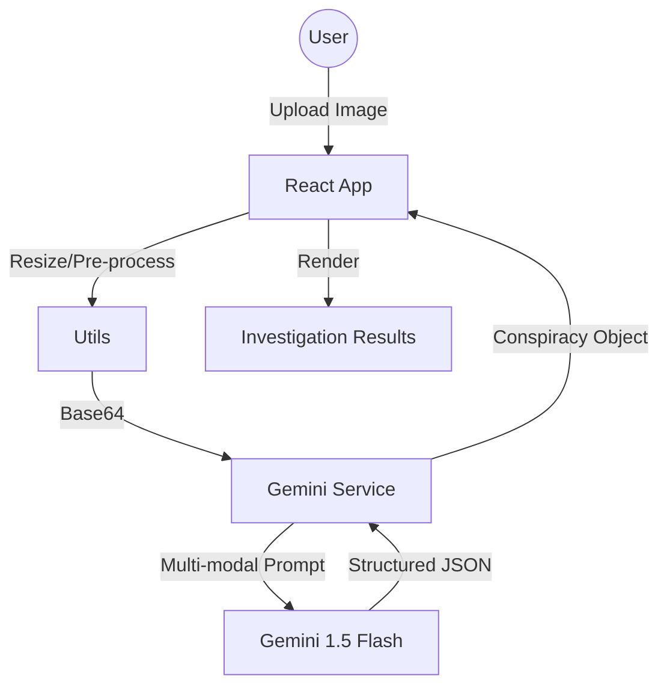

# TruthLens_AI

**TruthLens_AI** is an AI-powered "investigative tool" that uncovers the absurd, hidden truths behind ordinary objects. Upload a photo, and our high-level "whistleblower" AI will generate a cinematic, unhinged conspiracy theory complete with evidence boards, timelines, and fake Reddit leaks.

### Screenshots
<!-- 
 -->


## Technologies Used

- **React 18 & Vite**: Modern, lightning-fast frontend framework.
- **Google Gemini 1.5 Flash**: Orchestrating deep-image analysis and creative narrative generation.
- **Tailwind CSS**: Custom "Hacker/Brutalist" UI styling.
- **Framer Motion**: Smooth, cinematic transitions and glitch effects.
- **Lucide React**: Vector icons for the investigative interface.
- **TypeScript**: Type-safe development for complex AI data structures.

## Architecture

The application follows a clean, single-page application (SPA) architecture:

1. **Client Layer**: React components handling state, image uploads, and rendering.
2. **Analysis Service**: `geminiService.ts` handles communication with the Google Generative AI SDK, performing multi-modal analysis (Image + Text).
3. **Data Layer**: JSON-schema driven AI responses ensure structured data for evidence boards, timelines, and social leaks.



## How to Fork & Contribute

1. **Clone the repository**:
   ```bash
   git clone https://github.com/Ishitachauhann/TruthLens_AI.git
   ```
2. **Install dependencies**:
   ```bash
   npm install
   ```
3. **Set up environment variables**:
   Create a `.env` file and add your Gemini API key:
   ```env
   GEMINI_API_KEY=your_api_key_here
   ```
4. **Run the development server**:
   ```bash
   npm run dev
   ```

### 💡 Ideas for New Features

- [ ] **Multi-Object Analysis**: Upload two photos to find a "secret connection" between them.
- [ ] **Voice Synthesis**: Use a text-to-speech engine to read the "Leaked Narrator Logs".
- [ ] **Export to PDF**: Generate a formal "Classified PDF" dossier for users to download.
- [ ] **Community Feed**: A public board where users can see the most unhinged theories generated.
